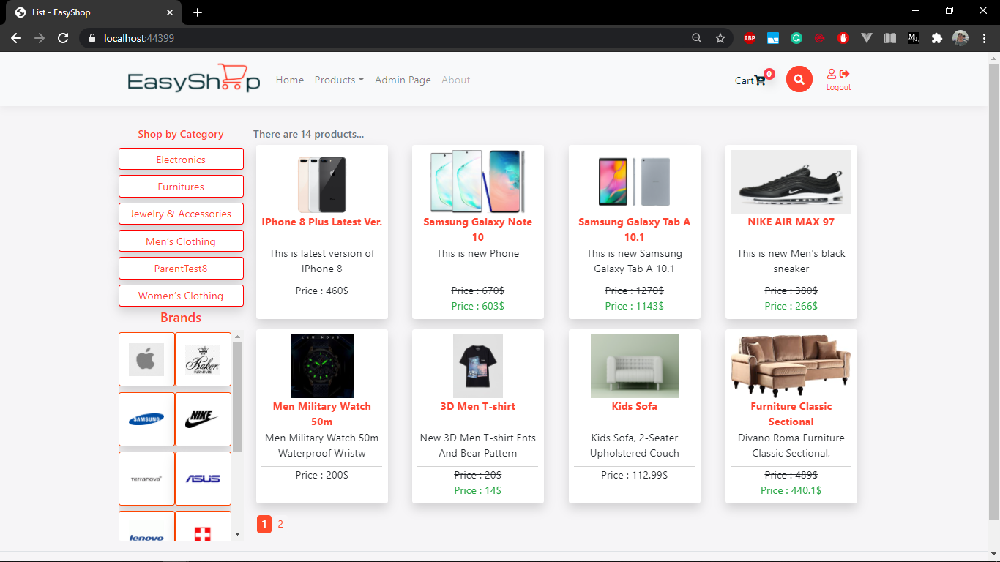



  

<h2 align="center">Online Shopping Project</h2>
 

*EasyShop* is a fully functional online shopping platform.This project developed based on the [MVC software design pattern](https://en.wikipedia.org/wiki/Model%E2%80%93view%E2%80%93controller) and you can find the source code of the front-end and back-end sides from this repository.

<h2 align="center">What technologies and design patterns were used in this project?</h2>

### 1. For back-end:
[ASP.NET Core MVC](https://docs.microsoft.com/en-us/aspnet/core/tutorials/first-mvc-app/start-mvc?view=aspnetcore-5.0&tabs=visual-studio)
, [EF Core](https://docs.microsoft.com/en-us/ef/core/)

### 2. For front-end:
[Razor Pages](https://docs.microsoft.com/en-us/aspnet/core/razor-pages/?view=aspnetcore-5.0&tabs=visual-studio)
, [Bootstrap](https://getbootstrap.com/docs/4.5/getting-started/introduction/)
, [HTML](https://en.wikipedia.org/wiki/Model%E2%80%93view%E2%80%93controller)
, [CSS](https://www.w3schools.com/css/)
, [JavaScript](https://www.w3schools.com/js/DEFAULT.asp)
, [jQuery (AJAX)](https://www.w3schools.com/jquery/jquery_ajax_intro.asp)

### 3.Design Patterns
[MVC](https://en.wikipedia.org/wiki/Model%E2%80%93view%E2%80%93controller)
, [Repository Pattern](https://medium.com/net-core/repository-pattern-implementation-in-asp-net-core-21e01c6664d7)
, [Unit of Work Pattern](https://docs.microsoft.com/en-us/aspnet/mvc/overview/older-versions/getting-started-with-ef-5-using-mvc-4/implementing-the-repository-and-unit-of-work-patterns-in-an-asp-net-mvc-application)
, [AJAX](https://en.wikipedia.org/wiki/Ajax_(programming))

### 4. Database:
Thanks to [ORM(Object–relational mapping)](https://en.wikipedia.org/wiki/Object%E2%80%93relational_mapping) technique and [EF Core framework](https://docs.microsoft.com/en-us/ef/core/),we don't have to create database by writing queries manually.In this project, EF core is used and it created two databases in the local SQL Server.The first one is **EasyShopDB** which was created to store data of brands, parent and subcategories, orders, products and features of the products. Second one is **EasyShopIdentityDB** which was created for storing the data of users. EF core generated these databases based on  [EasyShopContext](https://github.com/raufhacizade/easyshop/blob/master/EasyShop/Repository/Concrete/EntityFramework/EasyShopContext.cs) and [AppIdentityDbContext](https://github.com/raufhacizade/easyshop/blob/master/EasyShop/IdentityEntity/AppIdentityDbContext.cs) clases.

<h2 align="center">Screen records and pictures to demonstrate functionalities of EasyShop.</h2>



  
   
  

